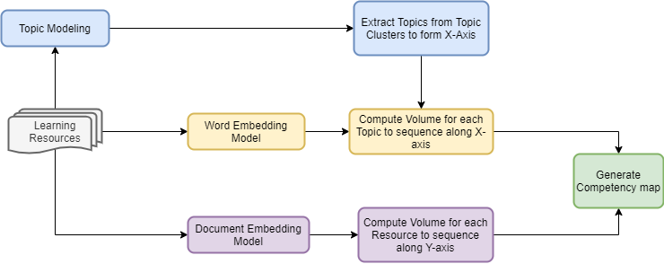

.. highlight:: shell

=====================================
Approach to Construct Competency Maps
=====================================

High Level Design
-----------------

Competency Map organises a learning space in terms of basic units of learning, each of which is called a competency.
The competency map is organised as a 2-dimensional progression space. A progression space not only has a concept of
distance between any pairs of competencies, but also a partial ordering that indicates progress made by a learner
on reaching some competency. In addition to the idea of progression, a competency map needs to be organised such
that, learning resources mapped onto the space can create coherent sequences of learning pathways that can be
traversed on the space.

To create a competency map given a representative set of learning resources,
we follow the below 5 step approach:

1. Identify Topics to form the X-axis
2. Topic sequencing on X-axis
3. Sequencing on Y-axis
4. Identifying Suitable Locations for the Resources
5. Generate the competency map

Figure below shows the overall approach:

Identify Topics to form the X-axis
----------------------------------

For identifying the topics that represent the corpus of learning resources, we use topic modelling techniques.
Topic models are algorithms that are used for discovering the main themes that describe unstructured collection of
documents. There are several algorithms that can be used to perform topic modelling. Here, we provide 3 choices:
1. LDA
2. LDAMallet
3. Hierarchical LDA

All of these are variations of the `Latent Dirichlet Allocation (LDA) Model`_ which is the
most popular and widely used topic modelling algorithm. LDA is a generative probabilistic model that assumes
each document is a mixture over a set of topic probabilities and each topic is a mixture over an underlying set of words.
We consider the underlying set of words from each of the topic clusters obtained from the LDA Model as the topics
for the competency map.

To determine the optimal number of topic clusters for a given corpus, we can use any one of the 3 below
different `metrics`_:

1. Coherence Value (cv_score)
2. UMASS Value (umass_score)
3. Log perplexity (lp).

We train several LDA models each with different number of topic clusters. The LDA model with the highest metric score
is considered as the best model. Once the set of topic clusters are identified, we use the notion of
`relevance`_ to identify and extract the top $n$ significant words from each cluster. Each of these words
constitute the topics for the competency map. Relevance is a method of ranking terms within a topic cluster.

The number of topics that will be extracted from each cluster is provided as an input. We divide this number
by three to obtain the relevant, marker and generic topics in equal proportion respectively.
1. Relevant Topics: We set lambda = 0.6 to obtain relevant topics which provide the best interpretation to the topic
clusters.
2. We set lambda=0 to obtain marker topics which are topics that are specific to a cluster. Marker topics can be
considered as milestones that identify key competencies in the competency map
3. We set lambda=1 to get generic topics that are common to all the clusters. Generic topics are considered to be
connecting competencies between two marker topics.

The number of topics thus obtained from all the topic clusters form the X-axis range for the competency map.

.. _Latent Dirichlet Allocation (LDA) Model: https://en.wikipedia.org/wiki/Latent_Dirichlet_allocation
.. _metrics: https://datascienceplus.com/evaluation-of-topic-modeling-topic-coherence/
.. _relevance: https://github.com/bmabey/pyLDAvis

Topic sequencing on X-axis
--------------------------
To sequence the topics on the X-axis, we compute the **volume** for each topic from the word embeddings and arrange
them in ascending order of this metric. Word embeddings create a numerical representation for words in
the form of vectors that capture their meanings, semantic relationships and the different types of contexts they are
used in. We provide 3 options for constructing a word embedding model:

1. `Word2vec`_
2. `Glove`_
3. `Fasttext`_

Typically, word embeddings are high dimensional vectors  where each dimension can be thought of as semantic
feature in the broader, higher-dimensional semantic space. To be able to capture the semantics and retain the
importance of the topic across all dimensions, we use the volume metric which is the log-sum of the absolute values
of the corresponding embedding vector.

.. _Word2vec: https://arxiv.org/pdf/1301.3781.pdf
.. _Fasttext: https://arxiv.org/abs/1607.04606
.. _Glove: http://nlp.stanford.edu/projects/glove/

Sequencing on Y-axis
--------------------

To arrange the learning resources in increasing order of their complexity/importance, we use the **volume** metric
obtained from document embedding models. Document embedding methods reduce an entire document into a
single n-dimensional vector and is usually a function of the word vectors of the words contained in them.
We utilise the `doc2vec`_ model to generate resource embeddings. For each learning resource we then compute the volume
which is the log-sum of the absolute values of the corresponding embedding vector.

.. _doc2vec: https://arxiv.org/abs/1405.4053v2

Identifying Suitable Locations for the Resources
------------------------------------------------

For all the learning resources in the corpus, the X and Y coordinates are calculated and the learning resource is
mapped to the competency map. Mapping a learning resource on the Y-axis is straight forward, the volume of the resource
$V_{r}$ is computed as described in previous section and is used as the Y coordinate for the learning resource.

To map learning resources on X-axis, we first find the probability of the learning resources belonging to the set of
topics that it represents and then take a weighted average of the same. To determine the probability that the learning
resource is mapped to the topics, we use the following two probabilities:

1. Resource Cluster Probability *p(r|c)* which is the probability that a resource *r* is mapped to a topic cluster *c*
2. Topic Cluster Probability *p(t|c)* which is the probability that a topic t belongs to a topic cluster(c).

We first identify the topic cluster to which a learning resource is best mapped to. Once this is identified, for all
the topics in this topic cluster we obtain the resource_topic_probability by multiplying the Resource Cluster Probability
and the Topic Cluster Probability.

We calculate the X coordinate for each learning resource by computing the weighted sum of the probabilities of all the
topics the learning resource represents. This weighted sum is computed by normalising the probabilities of all the
constituent topics.

Generating the Competency Map
-----------------------------

The final step in the competency map generation process is to transform the coordinates of each learning resource
into the competency map space. Each learning resource is characterised currently by two attributes - **r_x** and **V_r**.
We then transform these attributes to the competency map space.

1. Transform the X-coordinate  - The X-axis in the competency map space ranges from 0 to the number of topics($N_t$).
We must hence scale the **r_x** value for each learning resource to a value in this range. We do that by binning the
topic volumes.

2. Transform the Y-coordinate - We define a metric called **level** for Y-axis which is a fixed interval for volumes.
Logically this means that, the learning resources that have similar importance or complexity can be grouped together
in an interval. Once the levels are obtained, we again bin the resource volumes obtained to this range and obtain the
Y-Coordinate of the resource.
